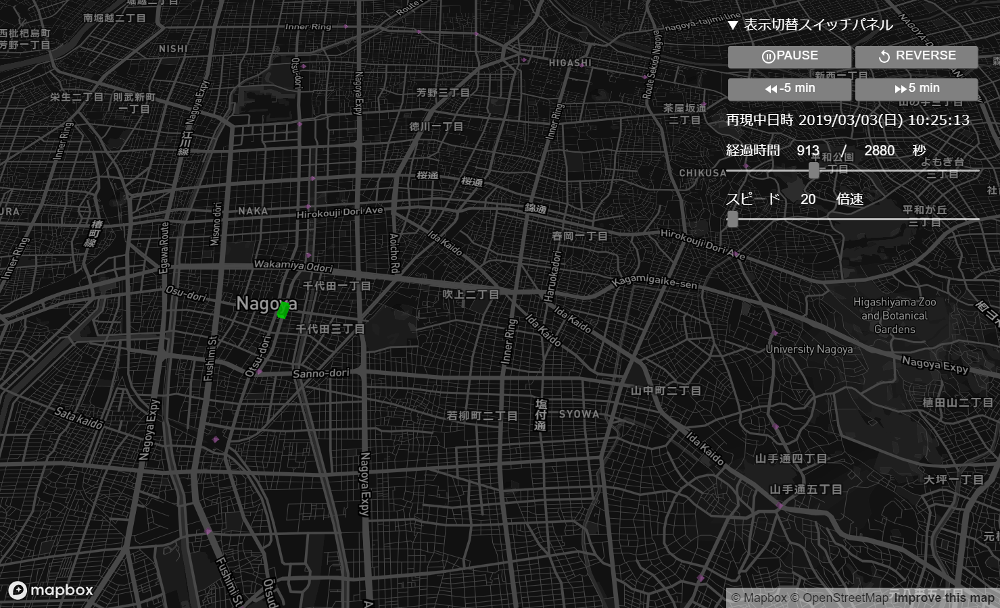

# pyharmovis


## Install
```
git clone https://github.com/Harmoware/pyharmovis.git
cd pyharmovis
pip install .
```

## Javascript library
The url of the javascript library to be used.

https://github.com/Harmoware/HarmoVisWidget/blob/main/library.js

The address in the laboratory LAN is here.

http://192.168.197.229/HarmoVis-widget/library.js

## Setting
Sign up for mapbox.com and get Accesstoken.  
Set the acquired Accesstoken to the environment variable "MAPBOX_ACCESS_TOKEN".

### How to set up Accesstoken
```
import pyharmovis as phv
hvdeck = phv.HvDeck(mapboxApiKey='(environment variable key or Accesstoken itself)')
hvdeck.display()
```

## Sample code
### Use DataFrame
```
import pyharmovis as phv
import pandas as pd

df = pd.DataFrame(
    data=[[
        {"position":[136.945255,35.190691,0],"elapsedtime":1551575400,"name":"Nagoya Dome-mae Yada"},
        {"position":[136.936864,35.191591,0],"elapsedtime":1551575460,"name":"Ozone"},
        {"position":[136.929784,35.195934,0],"elapsedtime":1551575520,"name":"Heian-dori"},
        {"position":[136.921210,35.196281,0],"elapsedtime":1551575580,"name":"Shiga-hondori"},
        {"position":[136.910178,35.197183,0],"elapsedtime":1551575700,"name":"Kurokawa"},
        {"position":[136.904748,35.190528,0],"elapsedtime":1551575820,"name":"Meijo Koen"},
        {"position":[136.905379,35.181560,0],"elapsedtime":1551575940,"name":"City Hall"},
        {"position":[136.908156,35.173784,0],"elapsedtime":1551576060,"name":"Hisaya-odori"},
        {"position":[136.908031,35.169990,0],"elapsedtime":1551576120,"name":"Sakae"},
        {"position":[136.908898,35.163724,0],"elapsedtime":1551576240,"name":"Yaba-cho"},
        {"position":[136.906907,35.157963,0],"elapsedtime":1551576300,"name":"Kamimaezu"},
        {"position":[136.904771,35.150276,0],"elapsedtime":1551576420,"name":"Higashi Betsuin"},
        {"position":[136.900947,35.143257,0],"elapsedtime":1551576540,"name":"Kanayama"},
        {"position":[136.901769,35.134622,0],"elapsedtime":1551576660,"name":"Nishi Takakura"},
        {"position":[136.906622,35.127823,0],"elapsedtime":1551576780,"name":"Jingu NIshi"},
    ],[
        {"position":[136.919835,35.120141,0],"elapsedtime":1551576960,"name":"Horita"},
        {"position":[136.929545,35.117125,0],"elapsedtime":1551577080,"name":"Myoon-dori"},
        {"position":[136.937741,35.117728,0],"elapsedtime":1551577140,"name":"Aratama-bashi"},
        {"position":[136.948824,35.123331,0],"elapsedtime":1551577260,"name":"Mizuho Undojo Higashi"},
        {"position":[136.954523,35.130536,0],"elapsedtime":1551577380,"name":"Sogo Rihabiri Center"},
        {"position":[136.964036,35.136946,0],"elapsedtime":1551577500,"name":"Yagoto"},
        {"position":[136.965008,35.144556,0],"elapsedtime":1551577620,"name":"Yagoto Nisseki"},
        {"position":[136.966754,35.154519,0],"elapsedtime":1551577740,"name":"Nagoya Daigaku"},
        {"position":[136.963441,35.163923,0],"elapsedtime":1551577800,"name":"Motoyama"},
        {"position":[136.966701,35.175522,0],"elapsedtime":1551577920,"name":"Jiyugaoka"},
        {"position":[136.962254,35.184612,0],"elapsedtime":1551578040,"name":"Chayagasaka"},
        {"position":[136.954268,35.188806,0],"elapsedtime":1551578160,"name":"Sunada-bashi"},
    ]],
)
mvl = phv.MovesLayer()
mvl.setData(df)

hvdeck = phv.HvDeck()
hvdeck.setLayer(mvl)
hvdeck.display()
```

### Use List
```
import pyharmovis as phv

mvl = phv.MovesLayer()
mvl.setData([{"operation":[
    {"position":[136.945255,35.190691,0],"elapsedtime":1551575400,"name":"Nagoya Dome-mae Yada"},
    {"position":[136.936864,35.191591,0],"elapsedtime":1551575460,"name":"Ozone"},
    {"position":[136.929784,35.195934,0],"elapsedtime":1551575520,"name":"Heian-dori"},
    {"position":[136.921210,35.196281,0],"elapsedtime":1551575580,"name":"Shiga-hondori"},
    {"position":[136.910178,35.197183,0],"elapsedtime":1551575700,"name":"Kurokawa"},
    {"position":[136.904748,35.190528,0],"elapsedtime":1551575820,"name":"Meijo Koen"},
    {"position":[136.905379,35.181560,0],"elapsedtime":1551575940,"name":"City Hall"},
    {"position":[136.908156,35.173784,0],"elapsedtime":1551576060,"name":"Hisaya-odori"},
    {"position":[136.908031,35.169990,0],"elapsedtime":1551576120,"name":"Sakae"},
    {"position":[136.908898,35.163724,0],"elapsedtime":1551576240,"name":"Yaba-cho"},
    {"position":[136.906907,35.157963,0],"elapsedtime":1551576300,"name":"Kamimaezu"},
    {"position":[136.904771,35.150276,0],"elapsedtime":1551576420,"name":"Higashi Betsuin"},
    {"position":[136.900947,35.143257,0],"elapsedtime":1551576540,"name":"Kanayama"},
    {"position":[136.901769,35.134622,0],"elapsedtime":1551576660,"name":"Nishi Takakura"},
    {"position":[136.906622,35.127823,0],"elapsedtime":1551576780,"name":"Jingu NIshi"},
    {"position":[136.910380,35.120735,0],"elapsedtime":1551576840,"name":"Tenma-cho"},
    {"position":[136.919835,35.120141,0],"elapsedtime":1551576960,"name":"Horita"},
    {"position":[136.929545,35.117125,0],"elapsedtime":1551577080,"name":"Myoon-dori"},
    {"position":[136.937741,35.117728,0],"elapsedtime":1551577140,"name":"Aratama-bashi"},
    {"position":[136.948824,35.123331,0],"elapsedtime":1551577260,"name":"Mizuho Undojo Higashi"},
    {"position":[136.954523,35.130536,0],"elapsedtime":1551577380,"name":"Sogo Rihabiri Center"},
    {"position":[136.964036,35.136946,0],"elapsedtime":1551577500,"name":"Yagoto"},
    {"position":[136.965008,35.144556,0],"elapsedtime":1551577620,"name":"Yagoto Nisseki"},
    {"position":[136.966754,35.154519,0],"elapsedtime":1551577740,"name":"Nagoya Daigaku"},
    {"position":[136.963441,35.163923,0],"elapsedtime":1551577800,"name":"Motoyama"},
    {"position":[136.966701,35.175522,0],"elapsedtime":1551577920,"name":"Jiyugaoka"},
    {"position":[136.962254,35.184612,0],"elapsedtime":1551578040,"name":"Chayagasaka"},
    {"position":[136.954268,35.188806,0],"elapsedtime":1551578160,"name":"Sunada-bashi"},
    {"position":[136.945255,35.190691,0],"elapsedtime":1551578280,"name":"Nagoya Dome-mae Yada"}]}]
    )

hvdeck = phv.HvDeck()
hvdeck.setLayer([mvl])
hvdeck.display()
```

### Use Url
```
import pyharmovis as phv

mvl = phv.MovesLayer()
mvl.setData('http://192.168.197.229/HarmoVis-widget/nagoya-metro-meijo-line.json')

dpl = phv.DepotsLayer()
dpl.setData('http://192.168.197.229/HarmoVis-widget/nagoya-metro-meijo-line-depots.json')

hvdeck = phv.HvDeck()
hvdeck.setLayer([mvl,dpl])
hvdeck.display()
```

### Designation of viewpoints
```
import pyharmovis as phv
hvdeck = phv.HvDeck()
hvdeck.setViewport({"longitude": 136.7973447245247, "latitude": 35.30216933059135})
hvdeck.display()
```

## github
Refer to [github](https://github.com/Harmoware/pyharmovis "pyharmovis github repository").

## License
This project is licensed under the [Apache License 2.0](https://github.com/Harmoware/pyharmovis/blob/main/LICENSE).
